# Astrikos - Intelligent Infrastructure Visualization Platform


*Revolutionizing urban planning and infrastructure management through 3D visualization*

## Table of Contents
1. [Project Overview](#project-overview)
2. [Key Features](#key-features)
3. [Technology Stack](#technology-stack)
4. [System Architecture](#system-architecture)
5. [Installation Guide](#installation-guide)
6. [Configuration](#configuration)
7. [API Documentation](#api-documentation)
8. [Data Flow](#data-flow)
9. [Visualization Components](#visualization-components)
10. [Performance Optimization](#performance-optimization)
11. [Security Considerations](#security-considerations)
12. [Testing Strategy](#testing-strategy)
13. [Deployment Guide](#deployment-guide)
14. [Usage Examples](#usage-examples)
15. [Troubleshooting](#troubleshooting)
16. [Contributing](#contributing)
17. [License](#license)
18. [Acknowledgements](#acknowledgements)
19. [Future Roadmap](#future-roadmap)
20. [Learning Resources](#learning-resources)

## Project Overview

Astrikos.AI is an advanced visualization platform designed to transform how cities, industries, and enterprises manage infrastructure challenges. Our solution combines cutting-edge 3D visualization with real-time data analytics to provide actionable insights for urban planning, emergency management, and logistics optimization.

### Problem Statement

Modern infrastructure management faces several challenges:
- Fragmented data visualization tools
- Lack of real-time integration
- Limited 3D spatial analysis capabilities
- Poor collaboration between stakeholders

Astrikos.AI addresses these challenges by providing:
- Unified 3D/2D visualization platform
- Real-time data integration
- Collaborative tools for decision-making
- Scalable architecture for large datasets

### Target Use Cases

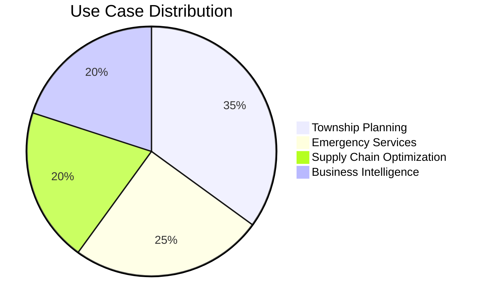

## Key Features

### Core Functionalities

1. **Multi-Dimensional Visualization**
   - 3D city models with real-time data overlays
   - 2D charts and graphs synchronized with 3D views
   - Interactive heatmaps and thematic maps

2. **Real-Time Data Integration**
   - IoT sensor data visualization
   - Traffic flow monitoring
   - Infrastructure status updates

3. **Collaborative Tools**
   - Shared visualization sessions
   - Annotation and markup tools
   - Scenario simulation

### Technical Specifications

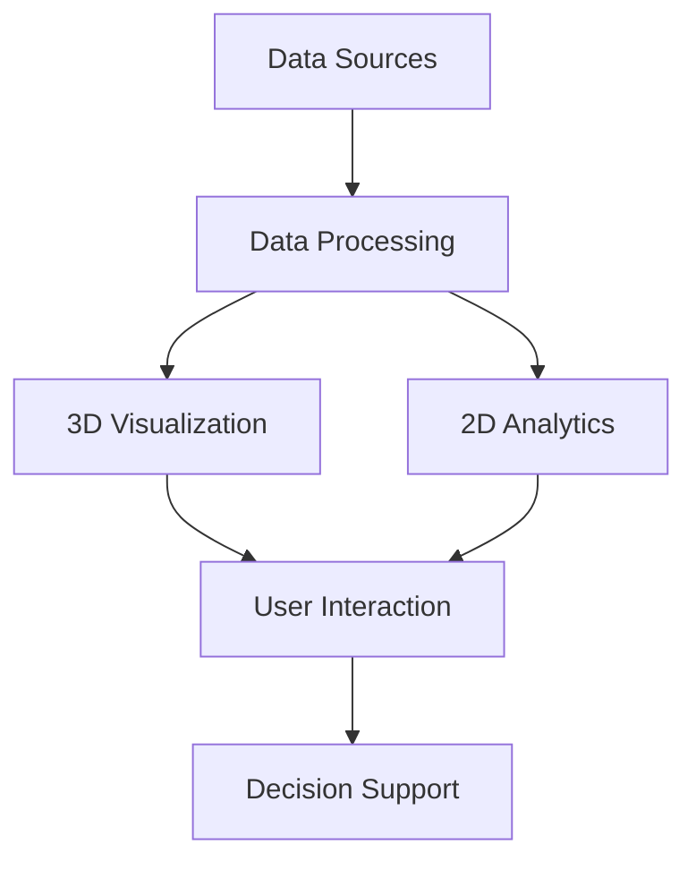

## Technology Stack

### Frontend

| Technology | Purpose | Version |
|------------|---------|---------|
| React | UI Framework | 18.2.0 |
| TypeScript | Type Safety | 4.9.5 |
| Three.js | 3D Rendering | r152 |
| D3.js | Data Visualization | 7.8.5 |
| Mapbox GL JS | GIS Mapping | 2.15.0 |
| Chart.js | Analytics Charts | 4.4.0 |

### Backend

| Technology | Purpose | Version |
|------------|---------|---------|
| Node.js | Runtime | 18.16.0 |
| Express | API Server | 4.18.2 |
| Firebase | Realtime DB | 9.22.0 |
| MongoDB | Data Storage | 6.0.8 |
| Redis | Caching | 4.6.7 |

### DevOps

| Technology | Purpose | Version |
|------------|---------|---------|
| Docker | Containerization | 23.0.5 |
| Kubernetes | Orchestration | 1.27.3 |
| GitHub Actions | CI/CD | - |
| Prometheus | Monitoring | 2.45.0 |
| Grafana | Visualization | 9.5.3 |

## System Architecture

### High-Level Architecture

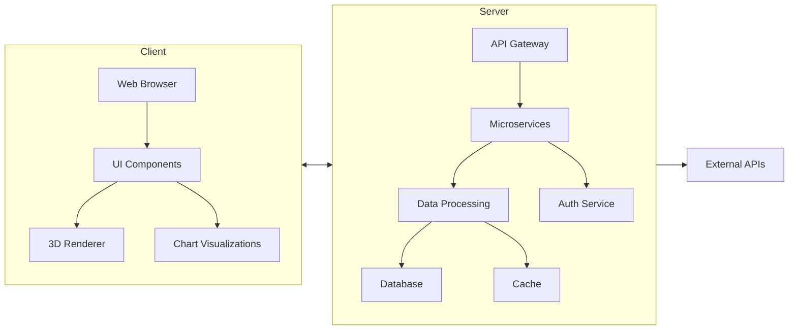

### Component Diagram

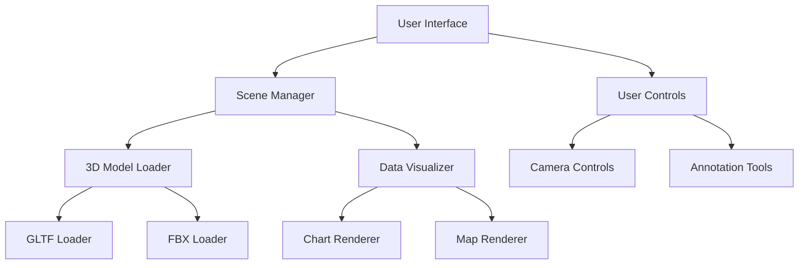

## Installation Guide

### Prerequisites

1. **System Requirements**
   - Node.js v18+
   - npm v9+
   - Python 3.10+ (for some data processing)
   - MongoDB 6.0+
   - Redis 7.0+

2. **Development Environment Setup**

```bash
# Clone the repository
git clone https://github.com/yourusername/astrikos-ai.git
cd astrikos-ai

# Install dependencies
npm install

# Set up environment variables
cp .env.example .env
```

### Backend Setup

```bash
# Navigate to server directory
cd server

# Install Python dependencies
pip install -r requirements.txt

# Start the server
npm run start:dev
```

### Frontend Setup

```bash
# Navigate to client directory
cd client

# Install dependencies
npm install

# Start development server
npm run dev
```

### Docker Deployment

```dockerfile
# Sample Dockerfile for backend
FROM node:18-alpine

WORKDIR /app
COPY package*.json ./
RUN npm install
COPY . .

EXPOSE 3000
CMD ["npm", "start"]
```

```bash
# Build and run containers
docker-compose up --build
```

## Configuration

### Environment Variables

| Variable | Description | Example |
|----------|-------------|---------|
| `MONGO_URI` | MongoDB connection string | `mongodb://localhost:27017/astrikos` |
| `MAPBOX_TOKEN` | Mapbox access token | `pk.abc123...` |
| `FIREBASE_CONFIG` | Firebase configuration | JSON string |
| `REDIS_URL` | Redis connection URL | `redis://localhost:6379` |

### Configuration Files

1. **Visualization Settings**

```json
// config/visualization.json
{
  "defaultCamera": {
    "position": [0, 100, 200],
    "target": [0, 0, 0]
  },
  "qualityPresets": {
    "low": {
      "resolution": 720,
      "shadows": false
    },
    "high": {
      "resolution": 1080,
      "shadows": true
    }
  }
}
```

## API Documentation

### Endpoints

| Method | Endpoint | Description |
|--------|----------|-------------|
| `GET` | `/api/cities` | Get list of cities |
| `POST` | `/api/cities` | Add new city data |
| `GET` | `/api/cities/:id` | Get city details |
| `GET` | `/api/data/real-time` | Stream real-time data |

### Example Requests

```javascript
// Fetching city data
fetch('/api/cities')
  .then(response => response.json())
  .then(data => {
    console.log('City data:', data);
  });

// Posting new data
fetch('/api/cities', {
  method: 'POST',
  headers: {
    'Content-Type': 'application/json',
  },
  body: JSON.stringify({
    name: 'New City',
    population: 500000,
    coordinates: [12.34, 56.78]
  }),
});
```

## Data Flow

### Visualization Pipeline

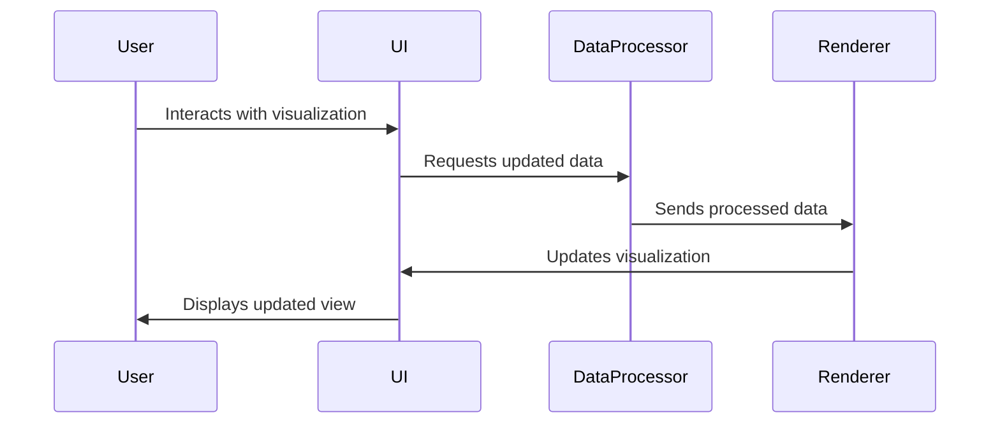

### Real-Time Data Handling

```javascript
// Example real-time data subscription
const socket = new WebSocket('wss://api.astrikos.ai/realtime');

socket.onmessage = (event) => {
  const data = JSON.parse(event.data);
  updateVisualization(data);
};

function updateVisualization(data) {
  // Process and render the new data
  chart.update(data.metrics);
  map.updateMarkers(data.locations);
  threeDScene.update(data.models);
}
```

## Visualization Components

### 3D City Model

```javascript
import * as THREE from 'three';
import { GLTFLoader } from 'three/examples/jsm/loaders/GLTFLoader';

class CityModel {
  constructor(scene) {
    this.scene = scene;
    this.loader = new GLTFLoader();
  }

  loadModel(url) {
    this.loader.load(url, (gltf) => {
      this.model = gltf.scene;
      this.scene.add(this.model);
      this.setupInteractions();
    });
  }

  setupInteractions() {
    // Add click handlers and other interactions
  }
}
```

### Data Visualization Dashboard

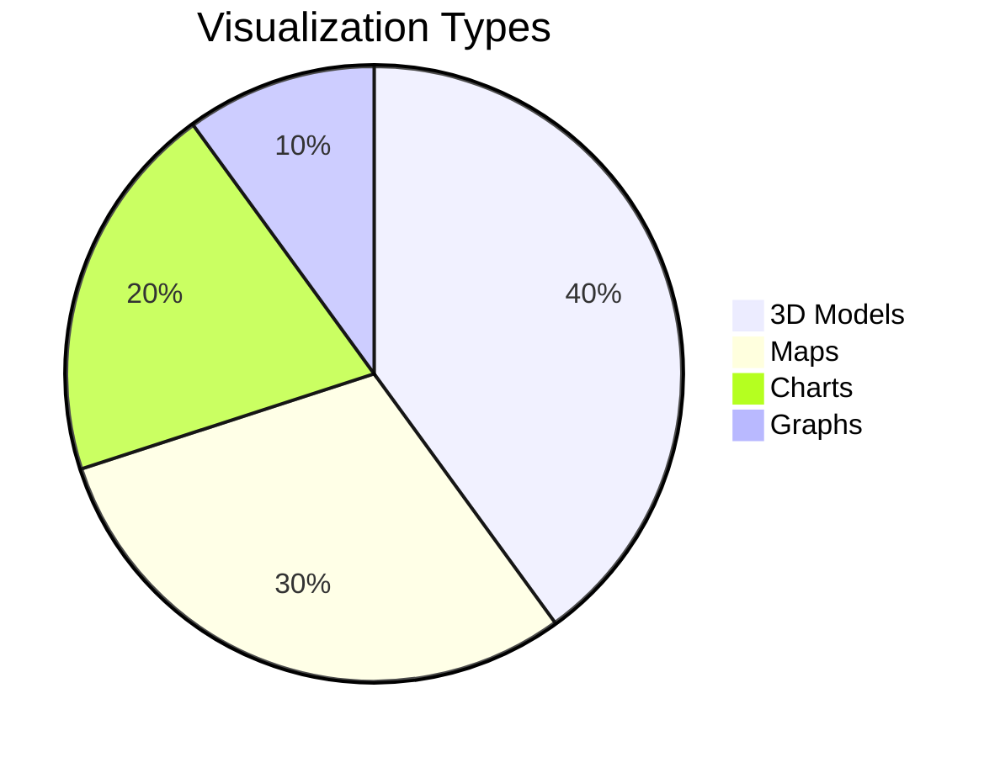

## Performance Optimization

### Rendering Optimization Techniques

1. **Level of Detail (LOD)**
```javascript
const lod = new THREE.LOD();
for (let i = 0; i < 5; i++) {
  const geometry = new THREE.BoxGeometry(10, 10, 10);
  const mesh = new THREE.Mesh(geometry, material);
  lod.addLevel(mesh, i * 50);
}
scene.add(lod);
```

2. **Instanced Rendering**
```javascript
const geometry = new THREE.BoxGeometry(1, 1, 1);
const material = new THREE.MeshBasicMaterial({color: 0x00ff00});
const instances = 1000;
const mesh = new THREE.InstancedMesh(geometry, material, instances);

for (let i = 0; i < instances; i++) {
  const matrix = new THREE.Matrix4();
  matrix.setPosition(Math.random() * 100, Math.random() * 100, Math.random() * 100);
  mesh.setMatrixAt(i, matrix);
}
scene.add(mesh);
```

## Security Considerations

### Security Measures

1. **Authentication Flow**
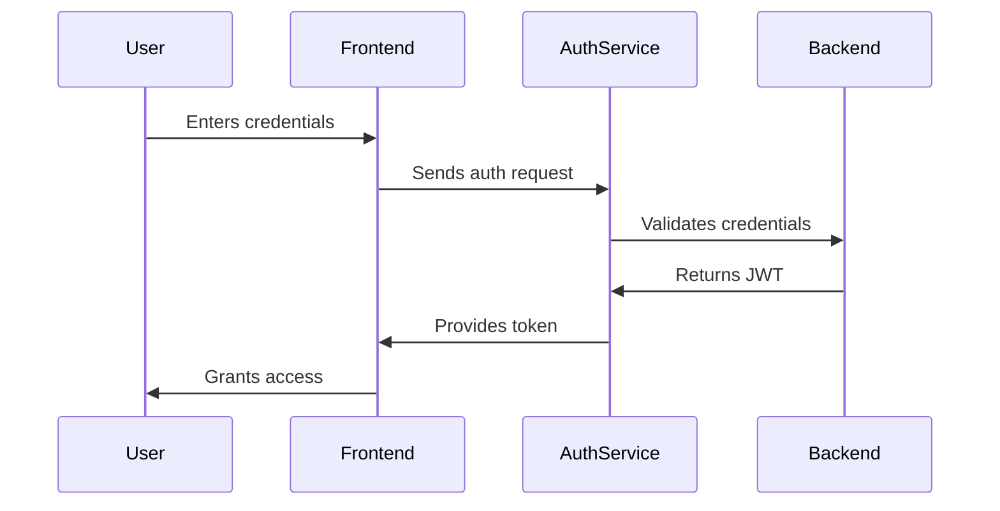

2. **Data Encryption**
```javascript
// Example encryption configuration
const securityConfig = {
  dataEncryption: {
    algorithm: 'aes-256-cbc',
    key: process.env.ENCRYPTION_KEY,
    ivLength: 16
  },
  https: {
    enforce: true,
    hsts: {
      maxAge: 31536000,
      includeSubDomains: true
    }
  }
};
```

## Testing Strategy

### Test Pyramid

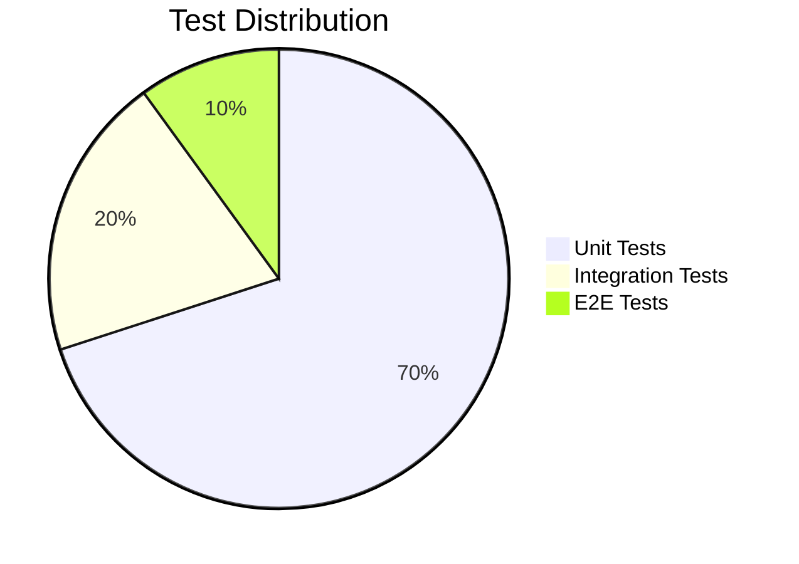

### Example Test Suite

```javascript
describe('City Visualization', () => {
  beforeAll(() => {
    initialize3DEngine();
  });

  test('loads 3D model correctly', async () => {
    const city = new CityModel();
    await city.loadModel('test-model.glb');
    expect(city.model).toBeDefined();
  });

  test('handles click events', () => {
    const mockHandler = jest.fn();
    city.onClick(mockHandler);
    simulateClick(city.model);
    expect(mockHandler).toHaveBeenCalled();
  });
});
```

## Deployment Guide

### Cloud Deployment (AWS)

```bash
# Terraform configuration for AWS
resource "aws_ecs_task_definition" "astrikos" {
  family                   = "astrikos"
  network_mode             = "awsvpc"
  requires_compatibilities = ["FARGATE"]
  cpu                      = "1024"
  memory                   = "2048"
  
  container_definitions = jsonencode([{
    name  = "astrikos-app"
    image = "astrikos/ai:latest"
    portMappings = [{
      containerPort = 3000
      hostPort      = 3000
    }]
  }])
}
```

### CI/CD Pipeline

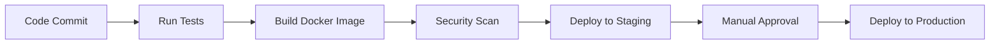

## Usage Examples

### Creating a New Visualization

```javascript
import { VisualizationBuilder } from 'astrikos-sdk';

const builder = new VisualizationBuilder()
  .withBaseMap('mapbox://styles/mapbox/streets-v11')
  .add3DModel('city-model.glb')
  .addDataSource('traffic', {
    type: 'real-time',
    url: 'wss://api.astrikos.ai/traffic'
  })
  .addChart({
    type: 'bar',
    title: 'Traffic Density',
    dataSource: 'traffic'
  });

const visualization = builder.build();
visualization.render('#container');
```

### Example Dashboard

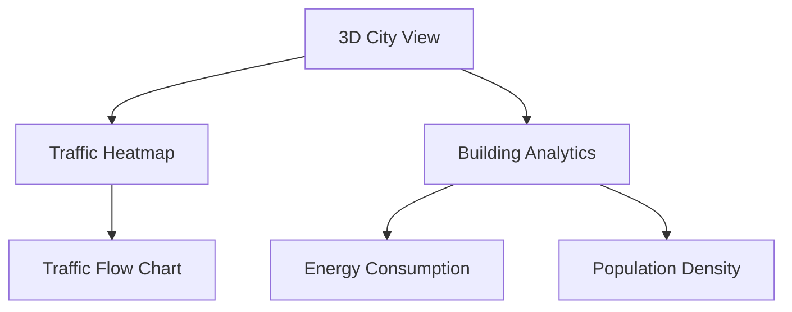

## Troubleshooting

### Common Issues

| Issue | Solution |
|-------|----------|
| 3D models not loading | Check CORS headers and model file paths |
| Performance lag | Reduce model complexity or enable LOD |
| Map not displaying | Verify Mapbox token is valid |
| Real-time data not updating | Check WebSocket connection status |

### Debugging Tips

```javascript
// Enable debug mode
Astrikos.enableDebug({
  renderStats: true,
  wireframe: false,
  boundingBoxes: true
});

// Example debug output
// FPS: 60 | Draw Calls: 120 | Triangles: 50k
```

## Contributing

### Development Workflow

1. Fork the repository
2. Create a feature branch
3. Commit changes
4. Push to branch
5. Open pull request

### Code Standards

```javascript
// Example component structure
/**
 * City Visualization Component
 * @param {Object} props - Component props
 * @param {string} props.cityId - ID of city to visualize
 * @param {boolean} [props.showTraffic=false] - Whether to show traffic data
 */
function CityVisualization({ cityId, showTraffic = false }) {
  // Component implementation
}
```

## License

Apache License 2.0

```
Copyright 2025 Fortran

Licensed under the Apache License, Version 2.0 (the "License");
you may not use this file except in compliance with the License.
You may obtain a copy of the License at

    http://www.apache.org/licenses/LICENSE-2.0

Unless required by applicable law or agreed to in writing, software
distributed under the License is distributed on an "AS IS" BASIS,
WITHOUT WARRANTIES OR CONDITIONS OF ANY KIND, either express or implied.
See the License for the specific language governing permissions and
limitations under the License.
```

## Acknowledgements

- Three.js community for 3D rendering capabilities
- Mapbox for geospatial visualization tools
- D3.js for data visualization inspiration
- React community for component architecture

## Future Roadmap

### Upcoming Features

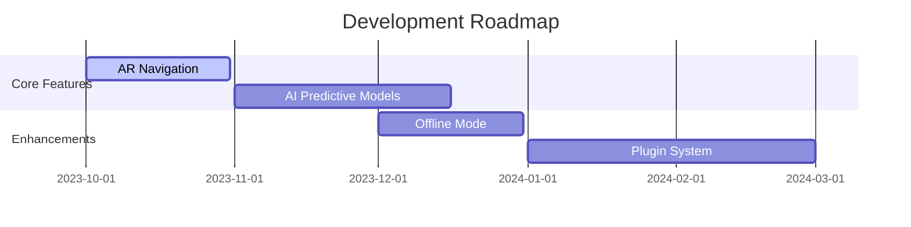

## Learning Resources

### Recommended Reading

1. **Three.js Fundamentals**  
   [https://threejs.org/manual/](https://threejs.org/manual/)

2. **Geospatial Visualization**  
   [https://docs.mapbox.com/mapbox-gl-js/guides/](https://docs.mapbox.com/mapbox-gl-js/guides/)

3. **Data Visualization Best Practices**  
   [https://www.d3indepth.com/](https://www.d3indepth.com/)


### Community

Join our developer community:
- [Discord Channel](https://discord.gg/astrikos)
- [GitHub Discussions](https://github.com/astrikos-ai/discussions)
- [Stack Overflow Tag](https://stackoverflow.com/questions/tagged/astrikos)

---

This concludes the comprehensive documentation for Astrikos.AI. For additional support, please contact our developer relations team at developers@astrikos.ai.
