# Astrikos - Intelligent Infrastructure Visualization Platform


*Revolutionizing urban planning and infrastructure management through 3D visualization*
*Refer to testing/utso for most updated code*

## Table of Contents
1. [Project Overview](#project-overview)
2. [Key Features](#key-features)
3. [Technology Stack](#technology-stack)
4. [System Architecture](#system-architecture)
5. [Installation Guide](#installation-guide)
6. [Configuration](#configuration)
7. [API Documentation](#api-documentation)
8. [Data Flow](#data-flow)
9. [Visualization Components](#visualization-components)
10. [Performance Optimization](#performance-optimization)
11. [Security Considerations](#security-considerations)
12. [Testing Strategy](#testing-strategy)
13. [Deployment Guide](#deployment-guide)
14. [Usage Examples](#usage-examples)
15. [Troubleshooting](#troubleshooting)
16. [Contributing](#contributing)
17. [License](#license)
18. [Acknowledgements](#acknowledgements)
19. [Future Roadmap](#future-roadmap)
20. [Learning Resources](#learning-resources)

## Project Overview

This project is an advanced visualization platform designed to transform how cities, industries, and enterprises manage infrastructure challenges. Our solution combines cutting-edge 3D visualization with real-time data analytics to provide actionable insights for urban planning, emergency management, and logistics optimization.

### Problem Statement

Modern infrastructure management faces several challenges:
- Fragmented data visualization tools
- Lack of real-time integration
- Limited 3D spatial analysis capabilities
- Poor collaboration between stakeholders

Astrikos.AI addresses these challenges by providing:
- Unified 3D/2D visualization platform
- Real-time data integration
- Collaborative tools for decision-making
- Scalable architecture for large datasets

### Target Use Cases

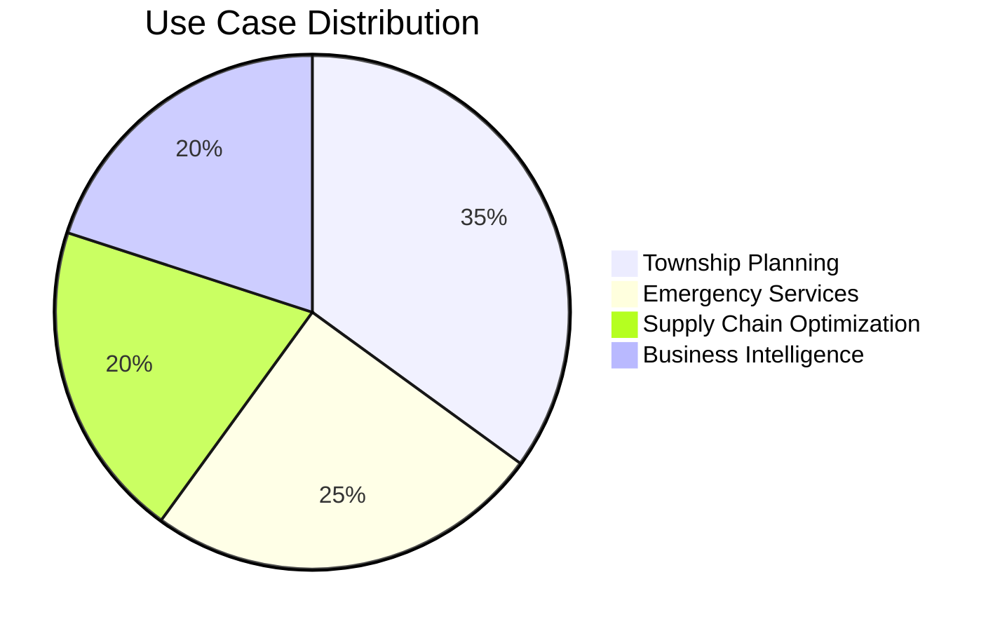

## Key Features

### Core Functionalities

1. **Multi-Dimensional Visualization**
   - 3D city models with real-time data overlays
   - 2D charts and graphs synchronized with 3D views
   - Interactive heatmaps and thematic maps

2. **Real-Time Data Integration**
   - IoT sensor data visualization
   - Traffic flow monitoring
   - Infrastructure status updates

3. **Collaborative Tools**
   - Shared visualization sessions
   - Annotation and markup tools
   - Scenario simulation


### Technical Specifications

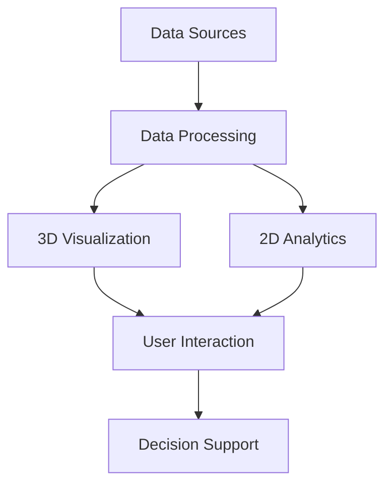

## Technology Stack

### Frontend

| Technology | Purpose | Version |
|------------|---------|---------|
| React | UI Framework | 18.2.0 |
| TypeScript | Type Safety | 4.9.5 |
| Three.js | 3D Rendering | r152 |
| D3.js | Data Visualization | 7.8.5 |
| Mapbox GL JS | GIS Mapping | 2.15.0 |
| Chart.js | Analytics Charts | 4.4.0 |

### Backend

| Technology | Purpose | Version |
|------------|---------|---------|
| Node.js | Runtime | 18.16.0 |
| Firebase | Realtime DB | 9.22.0 |


### Frontend Architecture

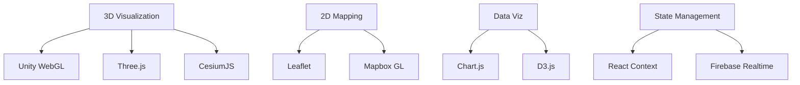

### JavaScript Packages Breakdown

#### Core Visualization Libraries
| Package | Version | Purpose |
|---------|---------|---------|
| `three` | ^0.175.0 | Core 3D rendering engine |
| `@react-three/fiber` | ^9.1.2 | React wrapper for Three.js |
| `@react-three/drei` | ^10.0.6 | Three.js helpers collection |
| `cesium` | ^1.128.0 | Geospatial 3D globe visualization |
| `resium` | ^1.19.0-beta.1 | React components for Cesium |
| `leaflet` | ^1.9.4 | Lightweight 2D mapping |
| `react-leaflet` | ^5.0.0 | React components for Leaflet |

#### Data Visualization
| Package | Version | Purpose |
|---------|---------|---------|
| `d3` | ^7.9.0 | Advanced data visualization |
| `chart.js` | ^4.4.9 | Interactive charts |
| `react-chartjs-2` | ^5.3.0 | React wrapper for Chart.js |
| `heatmap.js` | ^2.0.5 | Heatmap visualization |
| `leaflet-heatmap` | ^1.0.0 | Leaflet heatmap integration |
| `globe.gl` | ^2.41.4 | 3D globe visualization |
| `three-globe` | ^2.42.4 | Three.js globe component |

#### GIS & Mapping
| Package | Version | Purpose |
|---------|---------|---------|
| `mapbox-gl` | ^3.11.0 | Advanced vector mapping |
| `@types/mapbox-gl` | ^3.4.1 | TypeScript definitions |

#### Firebase Integration
| Package | Version | Purpose |
|---------|---------|---------|
| `firebase` | ^11.6.0 | Firebase SDK core |
| `react-firebase-hooks` | ^5.1.1 | Firebase React hooks |

#### Utility & UI
| Package | Version | Purpose |
|---------|---------|---------|
| `react` | ^19.0.0 | Core React library |
| `react-dom` | ^19.0.0 | React DOM rendering |
| `react-router-dom` | ^7.5.1 | Client-side routing |
| `react-icons` | ^5.5.0 | Icon library |
| `react-modal` | ^3.16.3 | Accessible modal dialogs |
| `axios` | ^1.8.4 | HTTP client |


## Porject Images

| Feature | Screenshot | Description |
|--------|------------|-------------|
| **Home Page** |  | The landing page showcasing a clean, minimal interface with navigation and call-to-action to log in or sign up. |
| **Login Page** |  | Simple login form with email and password inputs, styled with modern UI components. |
| **Signup Page** |  | User registration screen with multiple fields and an intuitive layout. |
| **Dashboard** |  | Main dashboard view with navigation to different modules. |
|  |  | Clean and interactive section-based dashboard UI. |
|  |  | Dark-themed variation of the dashboard view with integrated widgets. |
| **Visualization** |  | Real-time data visualization dashboard using 2D/3D map overlays. |
|  |  | Zoomed-in view with multiple data points plotted on city infrastructure. |
| **Custom Data** |  | User-uploaded custom data layers, visualized over a 3D model. |
|  |  | Data input interface with file upload and live preview features. |
| **City Analysis** |  | City-wise infrastructure analysis with statistical charts and mapping. |
|  |  | An alternate layout showing categorized city insights and KPIs. |
| **View Mode** |  | Switch between 2D and 3D views dynamically using toggle buttons. |
|  |  | Responsive map renderer for immersive infrastructure display. |
|  |  | Day-night toggle and camera controls for exploration. |
|  |  | Lighting and environmental effects showcased in 3D view. |
| **Editor Mode** |  | 3D model editor with layer and object manipulation tools. |
|  |  | Grid-aligned editor with structure positioning features. |
| **Creator Mode** |  | Creative workspace for designing infrastructure mockups and prototypes. |

---


## System Architecture

### High-Level Architecture

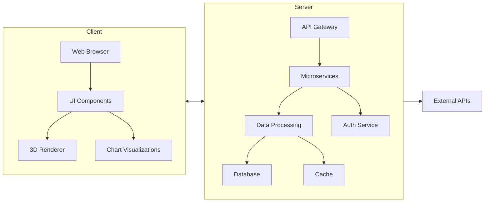

### Component Diagram

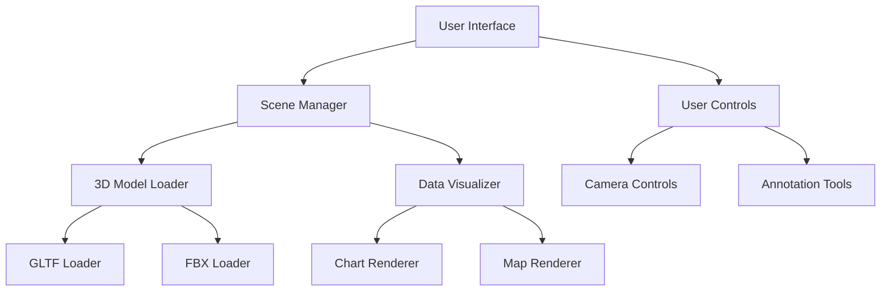

### Final Architecture Overview

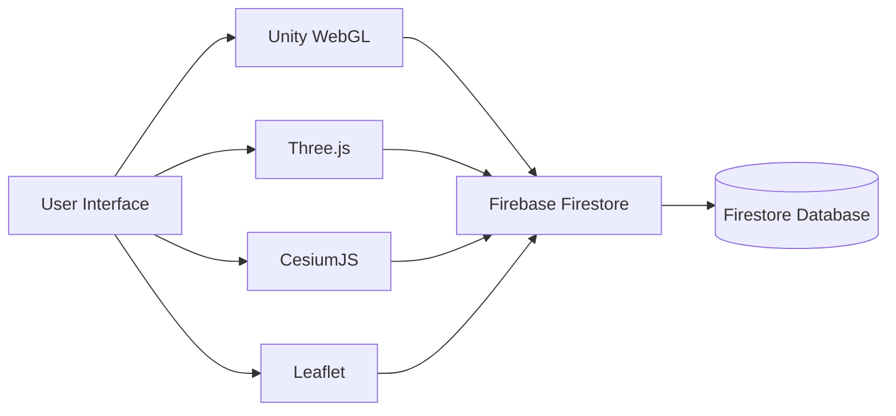

#Installation

## Prerequisites

Before you begin, ensure you have the following installed on your system:

- Node.js (v18 or higher)
- npm (v9 or higher)
- Git
- A modern web browser (Chrome, Firefox, or Edge recommended)

## Project Setup

### 1. Clone the Repository

```bash
git clone -b testing/utso --single-branch https://github.com/officiallyutso/astrikos-high-prep.git
cd astrikos-high-prep
```

### 2. Install Dependencies

```bash
npm install
```

This will install all required JavaScript packages including:
- React and related dependencies
- Three.js and visualization libraries
- CesiumJS and mapping components
- Firebase SDK

## Running the Application

### 1. Start the Development Server

```bash
npm run dev
```

This will:
- Start Vite development server
- Bundle all React components
- Launch the application in your default browser at `http://localhost:5173`

### 2. Running Unity WebGL Content

The Unity WebGL build is located in `public/create/`. To view it:

1. **Option A: Using Python Simple Server** (recommended for testing)
   ```bash
   cd public/create
   python -m http.server 8000
   ```
   Then open `http://localhost:8000/editor.html` in your browser

2. **Option B: Using Live Server Extension** (in VS Code)
   - Right-click on `editor.html`
   - Select "Open with Live Server"

## Project Structure

```
astrikos-high-prep/
├── public/                  # Static assets
│   └── create/              # Unity WebGL build
│       ├── Build/           # Unity compiled files
│       ├── TemplateData/     # Unity resources
│       └── editor.html      # Unity loader page
├── src/                     # React application
│   ├── assets/              # Static assets
│   ├── components/          # React components
│   ├── pages/               # Application pages
│   ├── services/            # Data services
│   └── styles/              # CSS files
├── .gitignore
├── package.json
├── tsconfig.json
└── vite.config.ts
```

## Configuration

### Environment Variables

| Variable | Description | Example |
|----------|-------------|---------|
| `MAPBOX_TOKEN` | Mapbox access token | `pk.abc123...` |
| `FIREBASE_CONFIG` | Firebase configuration | JSON string |
| `CEASIUM_TOKEN` | CEASIUM TOKEN | `eyJhbGciO...` |

### Configuration Files

1. **Visualization Settings**

```json
// config/visualization.json
{
  "defaultCamera": {
    "position": [0, 100, 200],
    "target": [0, 0, 0]
  },
  "qualityPresets": {
    "low": {
      "resolution": 720,
      "shadows": false
    },
    "high": {
      "resolution": 1080,
      "shadows": true
    }
  }
}
```

## API Documentation

### Endpoints

| Method | Endpoint | Description |
|--------|----------|-------------|
| `GET` | `/api/cities` | Get list of cities |
| `POST` | `/api/cities` | Add new city data |
| `GET` | `/api/cities/:id` | Get city details |
| `GET` | `/api/data/real-time` | Stream real-time data |

### Example Requests

```javascript
// Fetching city data
fetch('/api/cities')
  .then(response => response.json())
  .then(data => {
    console.log('City data:', data);
  });

// Posting new data
fetch('/api/cities', {
  method: 'POST',
  headers: {
    'Content-Type': 'application/json',
  },
  body: JSON.stringify({
    name: 'New City',
    population: 500000,
    coordinates: [12.34, 56.78]
  }),
});
```

## Data Flow

### Visualization Pipeline

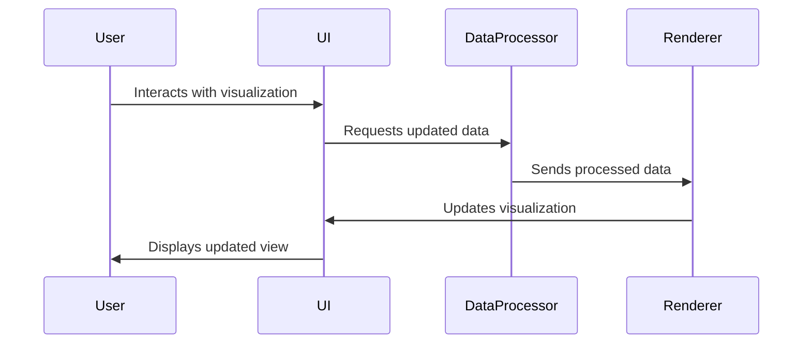

### Real-Time Data Handling

```javascript
// Example real-time data subscription
const socket = new WebSocket('wss://api.astrikos.ai/realtime');

socket.onmessage = (event) => {
  const data = JSON.parse(event.data);
  updateVisualization(data);
};

function updateVisualization(data) {
  // Process and render the new data
  chart.update(data.metrics);
  map.updateMarkers(data.locations);
  threeDScene.update(data.models);
}
```

## Visualization Components

### 3D City Model

```javascript
import * as THREE from 'three';
import { GLTFLoader } from 'three/examples/jsm/loaders/GLTFLoader';

class CityModel {
  constructor(scene) {
    this.scene = scene;
    this.loader = new GLTFLoader();
  }

  loadModel(url) {
    this.loader.load(url, (gltf) => {
      this.model = gltf.scene;
      this.scene.add(this.model);
      this.setupInteractions();
    });
  }

  setupInteractions() {
    // Add click handlers and other interactions
  }
}
```

### Data Visualization Dashboard

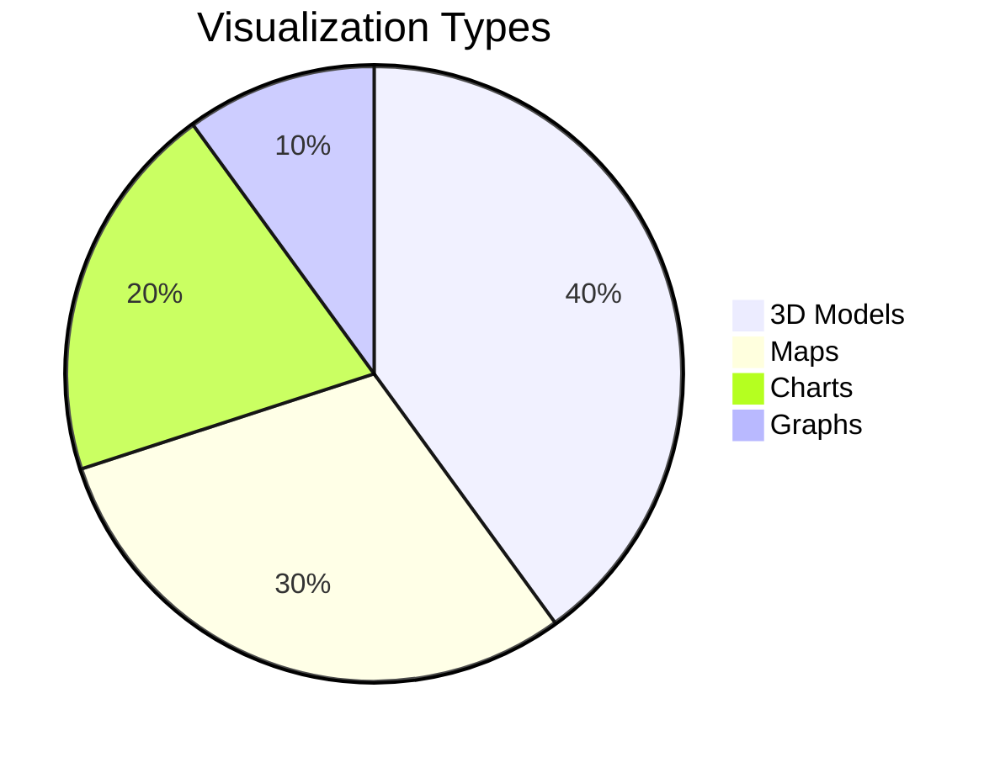

## Performance Optimization

### Rendering Optimization Techniques

1. **Level of Detail (LOD)**
```javascript
const lod = new THREE.LOD();
for (let i = 0; i < 5; i++) {
  const geometry = new THREE.BoxGeometry(10, 10, 10);
  const mesh = new THREE.Mesh(geometry, material);
  lod.addLevel(mesh, i * 50);
}
scene.add(lod);
```

2. **Instanced Rendering**
```javascript
const geometry = new THREE.BoxGeometry(1, 1, 1);
const material = new THREE.MeshBasicMaterial({color: 0x00ff00});
const instances = 1000;
const mesh = new THREE.InstancedMesh(geometry, material, instances);

for (let i = 0; i < instances; i++) {
  const matrix = new THREE.Matrix4();
  matrix.setPosition(Math.random() * 100, Math.random() * 100, Math.random() * 100);
  mesh.setMatrixAt(i, matrix);
}
scene.add(mesh);
```

## Security Considerations

### Security Measures

1. **Authentication Flow**
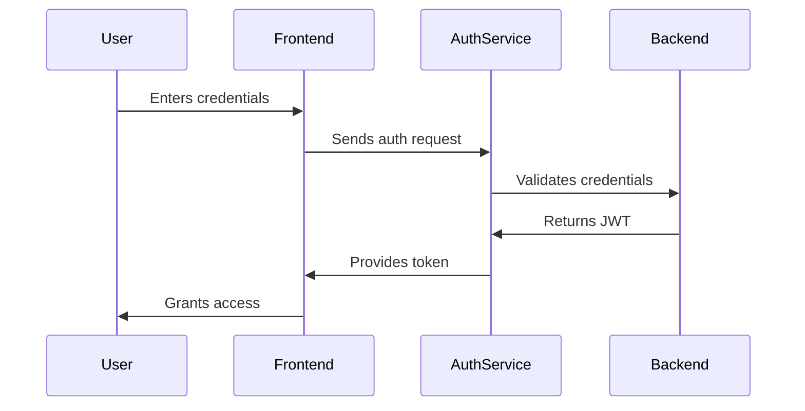

2. **Data Encryption**
```javascript
// Example encryption configuration
const securityConfig = {
  dataEncryption: {
    algorithm: 'aes-256-cbc',
    key: process.env.ENCRYPTION_KEY,
    ivLength: 16
  },
  https: {
    enforce: true,
    hsts: {
      maxAge: 31536000,
      includeSubDomains: true
    }
  }
};
```

## Testing Strategy

### Test Pyramid

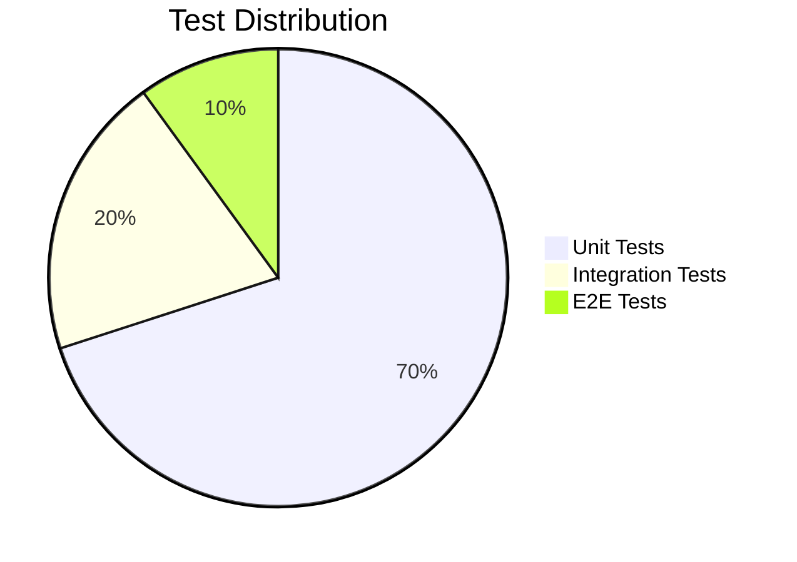

### Example Test Suite

```javascript
describe('City Visualization', () => {
  beforeAll(() => {
    initialize3DEngine();
  });

  test('loads 3D model correctly', async () => {
    const city = new CityModel();
    await city.loadModel('test-model.glb');
    expect(city.model).toBeDefined();
  });

  test('handles click events', () => {
    const mockHandler = jest.fn();
    city.onClick(mockHandler);
    simulateClick(city.model);
    expect(mockHandler).toHaveBeenCalled();
  });
});
```

## Deployment Guide

### Cloud Deployment (AWS)

```bash
# Terraform configuration for AWS
resource "aws_ecs_task_definition" "astrikos" {
  family                   = "astrikos"
  network_mode             = "awsvpc"
  requires_compatibilities = ["FARGATE"]
  cpu                      = "1024"
  memory                   = "2048"
  
  container_definitions = jsonencode([{
    name  = "astrikos-app"
    image = "astrikos/ai:latest"
    portMappings = [{
      containerPort = 3000
      hostPort      = 3000
    }]
  }])
}
```

### CI/CD Pipeline

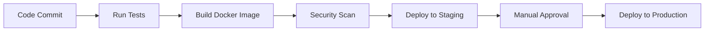

## Usage Examples

### Creating a New Visualization

```javascript
import { VisualizationBuilder } from 'astrikos-sdk';

const builder = new VisualizationBuilder()
  .withBaseMap('mapbox://styles/mapbox/streets-v11')
  .add3DModel('city-model.glb')
  .addDataSource('traffic', {
    type: 'real-time',
    url: 'wss://api.astrikos.ai/traffic'
  })
  .addChart({
    type: 'bar',
    title: 'Traffic Density',
    dataSource: 'traffic'
  });

const visualization = builder.build();
visualization.render('#container');
```

### Example Dashboard

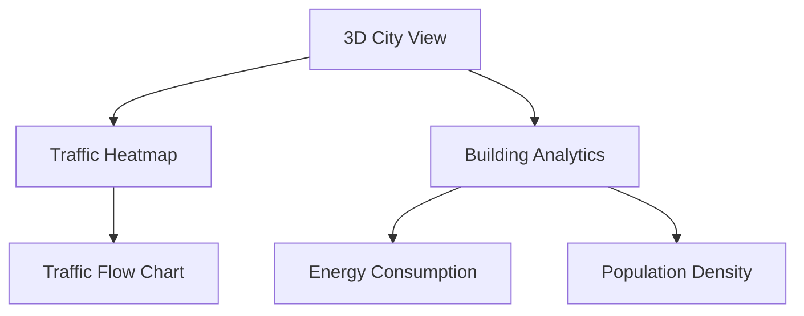

## Troubleshooting

### Common Issues

| Issue | Solution |
|-------|----------|
| 3D models not loading | Check CORS headers and model file paths |
| Performance lag | Reduce model complexity or enable LOD |
| Map not displaying | Verify Mapbox token is valid |
| Real-time data not updating | Check WebSocket connection status |

### Debugging Tips

```javascript
// Enable debug mode
Astrikos.enableDebug({
  renderStats: true,
  wireframe: false,
  boundingBoxes: true
});

// Example debug output
// FPS: 60 | Draw Calls: 120 | Triangles: 50k
```

## Contributing

### Development Workflow

1. Fork the repository
2. Create a feature branch
3. Commit changes
4. Push to branch
5. Open pull request

### Code Standards

```javascript
// Example component structure
/**
 * City Visualization Component
 * @param {Object} props - Component props
 * @param {string} props.cityId - ID of city to visualize
 * @param {boolean} [props.showTraffic=false] - Whether to show traffic data
 */
function CityVisualization({ cityId, showTraffic = false }) {
  // Component implementation
}
```

## License

Apache License 2.0

```
Copyright 2025 Fortran

Licensed under the Apache License, Version 2.0 (the "License");
you may not use this file except in compliance with the License.
You may obtain a copy of the License at

    http://www.apache.org/licenses/LICENSE-2.0

Unless required by applicable law or agreed to in writing, software
distributed under the License is distributed on an "AS IS" BASIS,
WITHOUT WARRANTIES OR CONDITIONS OF ANY KIND, either express or implied.
See the License for the specific language governing permissions and
limitations under the License.
```

## Acknowledgements

- Three.js community for 3D rendering capabilities
- Mapbox for geospatial visualization tools
- D3.js for data visualization inspiration
- React community for component architecture

## Future Roadmap

### Upcoming Features

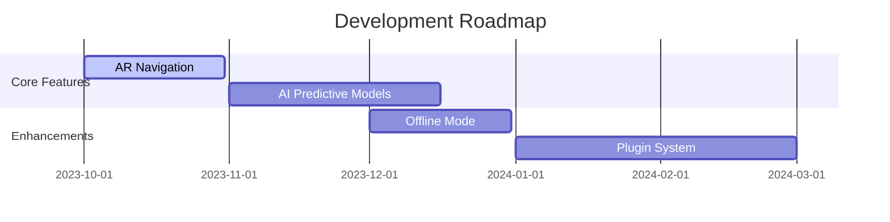

## Learning Resources

### Recommended Reading

1. **Three.js Fundamentals**  
   [https://threejs.org/manual/](https://threejs.org/manual/)

2. **Geospatial Visualization**  
   [https://docs.mapbox.com/mapbox-gl-js/guides/](https://docs.mapbox.com/mapbox-gl-js/guides/)

3. **Data Visualization Best Practices**  
   [https://www.d3indepth.com/](https://www.d3indepth.com/)


